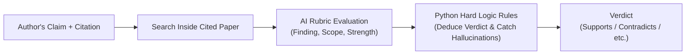
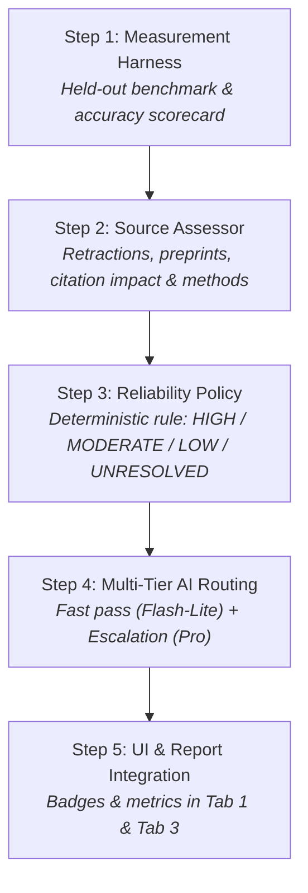

# Plan of Action: Upgrading Citation Judgement to a Scientific Reliability Auditor

## 1. Executive Summary

Today, **Citation Needed!** acts as a **faithful relation checker**: it answers the question:
> *"Did the cited paper actually say what the author claimed it said?"*

However, in real scientific research, **Supported $\neq$ Trustworthy**:
* A claim supported by a paper subsequently **retracted for fraud** is currently marked as **"Supports"**.
* A claim supported by an **unreviewed preprint** or a random passing mention in an introduction is treated with the same weight as a rigorously replicated experiment in *Nature*.
* The output is a *relation table*, lacking the **Source Assessment** and **Reliability Rating** (`HIGH / MODERATE / LOW / UNRESOLVED`) promised in the core pitch.

This plan details the step-by-step roadmap to transform the system into an authoritative, measurable **Scientific Reliability Auditor**.

---

## 2. How the System Judges Citations Today (In Simple English)



1. **Extract Claim & Target**: Finds the cited sentence in the seed paper and looks up the corresponding reference PDF.
2. **Retrieve Context**: Runs a document-scoped hybrid search (Dense Vectors + BM25) strictly inside that cited paper, expanding the best passage with neighbor chunks.
3. **Ask 3 Focused Questions (The V1.4 Rubric)**:
   * **The Finding**: Did the paper observe the asserted effect, or the opposite?
   * **The Scope**: Were the materials, temperatures, and measurement conditions identical?
   * **The Strength**: Was the result causal and proven, or merely a hedged hypothesis ("may suggest")?
4. **Programmatic Python Verification**:
   * Computes the verdict using strict truth-table logic (`derive_judgement`).
   * Verifies that the AI's quoted `supporting_span` exists word-for-word in the PDF.
   * Forcibly caps confidence if the AI hallucinated or broke rubric rules.
5. **Escalation**: If initial evidence is insufficient, it re-queries with a wider window (`top_k=3`) before deciding.

---

## 3. The Five-Step Action Plan



---

### Step 1: Build the Measurement Harness (Stop Guessing)

**Goal**: Establish a baseline so every prompt, rubric, or model tweak is backed by measurable accuracy metrics rather than intuition.

* **Files to create**:
  * [`research_assistant/judgement/evalset.py`](file:///run/media/shardul/storage1/research_assistant/research_assistant/judgement/evalset.py): Schema and loader with a mandatory **Held-Out Guard** (refuses to score cases appearing in `prompt.md`).
  * [`research_assistant/judgement/transforms.py`](file:///run/media/shardul/storage1/research_assistant/research_assistant/judgement/transforms.py): Model-free, deterministic test generators:
    * `number_swap`: Inverts numbers present in claim and evidence ($\times 2$ or $\times 0.5$) $\to$ tests if the judge detects *Contradicts*.
    * `scope_swap`: Replaces material/condition tokens ($\text{MoS}_2 \to \text{WSe}_2$; room temp $\to$ cryogenic) $\to$ tests if it detects *Does not support / Scope mismatch*.
    * `hedge_evidence`: Replaces assertive verbs with hedged phrases (*proves* $\to$ *may suggest*) $\to$ tests if it detects *Partially supports*.
    * `cross_pair`: Mismatches claims and evidence from different papers $\to$ tests *Does not support*.
  * [`research_assistant/judgement/metrics.py`](file:///run/media/shardul/storage1/research_assistant/research_assistant/judgement/metrics.py): Accuracy, confusion matrix (specifically isolating *Contradicts* vs. *Does not support*), rubric violation rates, and latency.
  * [`evaluate_judge.py`](file:///run/media/shardul/storage1/research_assistant/evaluate_judge.py): Command-line benchmark runner with side-by-side run comparisons.

---

### Step 2: Build the "Source Assessor" (Grade the Paper's Credibility)

**Goal**: Extract objective metadata and structural indicators to evaluate how much scientific trust the cited paper warrants.

* **Files to create**:
  * [`research_assistant/judgement/source_assessor.py`](file:///run/media/shardul/storage1/research_assistant/research_assistant/judgement/source_assessor.py)
* **Signals Evaluated**:
  1. **Retraction Status**: Crossref / OpenAlex API flag. If retracted, immediately flagged.
  2. **Publication Tier**: Peer-reviewed journal article vs. unreviewed preprint (arXiv/bioRxiv) vs. book chapter vs. conference abstract.
  3. **Citation Impact**: Overall community citation count from Crossref/OpenAlex.
  4. **Methodological Rigor**: Does the document contain a dedicated experimental Methods section with concrete sample sizes, or is it a brief theoretical commentary?
* **Output Classification (`SourceGrade`)**:
  * `RIGOROUS_PRIMARY` — Peer-reviewed experimental paper with detailed methods.
  * `STANDARD_PRIMARY` — Standard peer-reviewed paper.
  * `SECONDARY_REVIEW` — Literature review, meta-analysis, or perspective piece.
  * `PREPRINT_UNREVIEWED` — Non-peer-reviewed manuscript (arXiv/bioRxiv).
  * `RETRACTED_OR_FLAWED` — Retracted or flagged for severe editorial concerns.

---

### Step 3: Implement the "Reliability Policy" (The Master Rating)

**Goal**: Combine the **Text Verdict** (Step 2) with the **Source Grade** (Step 3) into a deterministic reliability classification.

* **Files to create**:
  * [`research_assistant/judgement/policy.py`](file:///run/media/shardul/storage1/research_assistant/research_assistant/judgement/policy.py)

#### Decision Matrix:

| Text Verdict (Relation) | Source Grade (Paper Rigor) | Final Reliability Rating | Meaning & Action |
| :--- | :--- | :--- | :--- |
| **Supports** | `RIGOROUS_PRIMARY` / `STANDARD_PRIMARY` | 🟢 **HIGH** | Solid citation; backed by verified primary peer-reviewed evidence. |
| **Supports** | `PREPRINT_UNREVIEWED` / `SECONDARY_REVIEW` | 🟡 **MODERATE** | Supported, but relies on a preprint or secondary review rather than direct primary proof. |
| **Supports** | `RETRACTED_OR_FLAWED` | 🔴 **LOW / CAUTION** | **Dangerous citation**: Paper text matches, but the source itself is retracted or invalid. |
| **Contradicts** | `RIGOROUS_PRIMARY` / `STANDARD_PRIMARY` | 🚨 **CONTRADICTED** | **High-priority dispute**: Rigorous peer-reviewed evidence directly refutes the claim. |
| **Does not support** | Any | 🟠 **UNSUPPORTED** | Cited paper does not report this relationship or tested different conditions. |
| **Unclear / Paywalled**| Any | ⚪ **UNRESOLVED** | PDF was paywalled or evidence in the paper was insufficient. |

---

### Step 4: Tiered AI Model Routing (Speed & Cost Optimization)

**Goal**: Eliminate CPU bottleneck and reduce API cost by using fast models for clear cases and reserving powerful models for disputed claims.

* **Tier 1 (Rapid Scan)**: Run initial verification using `gemini-2.5-flash-lite` (or local `gemma4:e2b` on CPU).
* **Tier 2 (Dispute Escalation)**: If a verdict is flagged as:
  * `Contradicts`
  * `Unclear / insufficient evidence`
  * `rubric_mismatch == True` (model disagreed with code rules)
  * Low confidence
  $\to$ Escalate **only that specific claim** to a higher-tier reasoning model (`gemini-2.5-pro`) with an expanded 12,000-character evidence window for an authoritative second opinion.

---

### Step 5: UI & Export Integration (Tabs 1 & 3)

**Goal**: Make reliability instantly actionable for the researcher.

* **Streamlit UI Updates** ([`app.py`](file:///run/media/shardul/storage1/research_assistant/app.py)):
  * **Summary KPI Cards**: Add a top-level reliability breakdown tile (*e.g., 14 High · 4 Moderate · 1 Low · 2 Contradicted · 3 Unresolved*).
  * **Table Column**: Add color-coded badges directly in the audit table (`HIGH`, `MODERATE`, `LOW`, `CONTRADICTED`).
  * **Source Badges**: Show whether the source is a Peer-Reviewed Journal, arXiv Preprint, or Review.
* **Audit Reports**: Include the `source_grade` and `reliability` in generated `.json` and `.md` reports.

---

## 4. Verification & Testing Protocol

In adherence to the **Mandatory Two-Cycle Verification Protocol**:

1. **Cycle 1 (Local Verification & Benchmarking)**:
   * Run existing unit tests to prevent regressions:
     ```bash
     CITATION_LOG_FILE=0 python -m pytest tests/test_judgement.py tests/test_verifier.py
     ```
   * Run the newly created evaluation suite:
     ```bash
     python evaluate_judge.py --mode judge
     ```
   * Deploy new modules to cloud VM and verify no broken imports.
2. **Cycle 2 (End-to-End Live Retest on Warm State)**:
   * Run a live seed paper audit in Tab 1.
   * Verify that papers are graded, reliability ratings are computed, and badges render cleanly in the Streamlit UI.
   * Confirm that persistent storage (`/mnt/disks/data`) remains intact.
